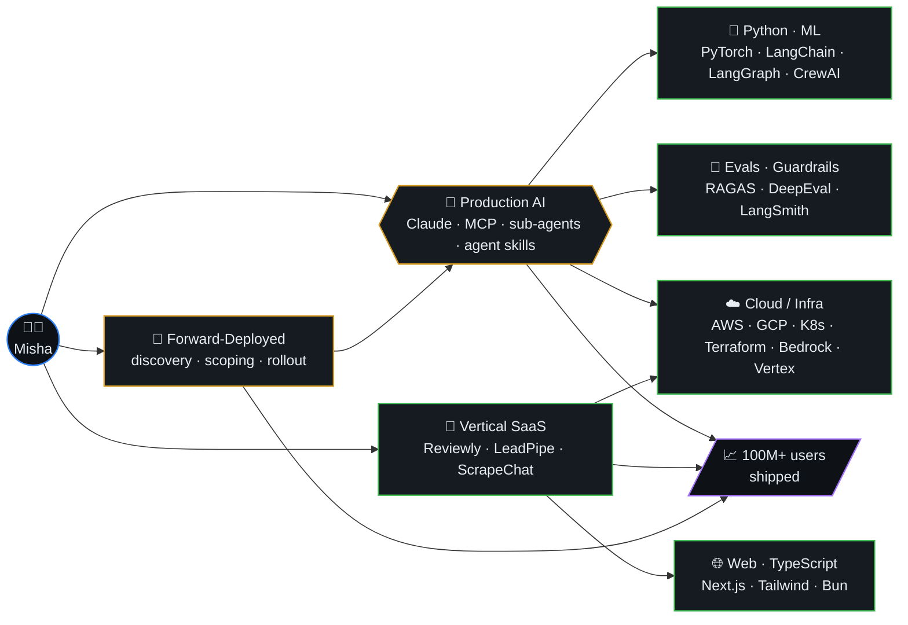
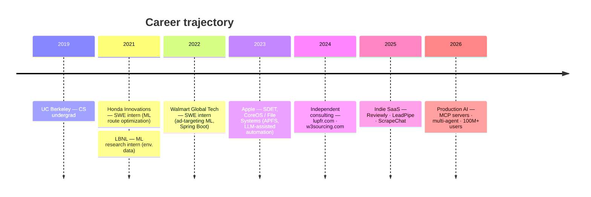
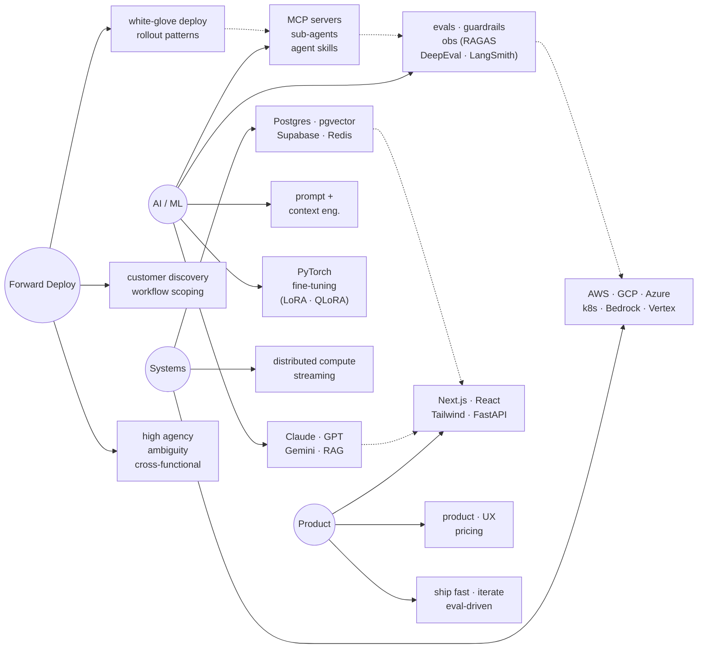

<!-- SEO: Misha Lubich | Forward-Deployed AI Engineer | Claude API | MCP servers | multi-agent orchestration | RAG pipelines | LLM production | UC Berkeley | ex-Apple | Python TypeScript Go | Anthropic | OpenAI | Gemini | LangChain | LangGraph | CrewAI | evals guardrails observability | FastAPI Next.js | AWS GCP Azure | 100M users | production machine learning | agent skills | sub-agents | context engineering | prompt engineering | RAGAS DeepEval LangSmith | pgvector FAISS Pinecone | LoRA QLoRA fine-tuning | forward deployed engineer | enterprise AI rollout | mishalubich.com -->

  

<h1 align="center">Hi, I'm Misha Lubich 👋</h1>

  

  
  
  
  
  
  

  
  
  
  
  

---

### 📊 Impact at a Glance

  
  
  
  
  
  

---

### 📚 Table of Contents

- [About Me](#-about-me)
- [What I'm Building](#️-what-im-building)
- [Career Timeline](#-career-timeline)
- [Skill Graph](#-skill-graph)
- [Tech Stack](#️-tech-stack)
- [Research & Publications](#-research--publications)
- [Featured Projects](#-featured-projects)
- [GitHub Stats](#-github-stats)
- [Profile Summary](#-profile-summary)
- [Contribution Graph](#-contribution-graph)
- [3D Contribution Calendar](#-3d-contribution-calendar)
- [Contribution Snake](#-contribution-snake)
- [Let's Collaborate](#-lets-collaborate)

---

### 🐍 Contribution Snake

  

---

### 👨‍💻 About Me

Forward-deployed AI engineer specializing in **customer-embedded production LLM delivery**. I sit with enterprise teams, scope real workflows, and ship Claude- and multi-model-powered applications hardened with evals, guardrails, and observability. Designed and deployed a production AI platform with multi-agent orchestration, MCP tool servers, sub-agents, and RAG pipelines serving **100M+ users at sub-second P95**. UC Berkeley CS grad with **6 published research papers**.

- 🔭 **Currently:** Shipping production agentic systems — MCP servers, sub-agents, agent skills, eval harnesses
- 🤝 **How I work:** Embedded with customer engineering and domain teams; high agency under ambiguity; codify reusable deployment patterns
- 🧠 **Stack:** Claude (Sonnet · Opus · Haiku) · Anthropic API · OpenAI · Gemini · Python · TypeScript · FastAPI · Next.js · AWS / GCP / Azure
- 💬 **Ask me about:** Production LLM apps, agent design, prompt + context engineering, eval-driven iteration, multi-agent orchestration, MCP
- 📫 **Reach me:** [Michaelle.lubich@gmail.com](mailto:Michaelle.lubich@gmail.com) · [mishalubich.com](https://mishalubich.com)
- 🔑 **Keywords:** `LLM engineer` · `Claude API` · `MCP servers` · `multi-agent` · `RAG` · `forward-deployed` · `AI production` · `evals` · `guardrails`

---

### 🏗️ What I'm Building

---

### 🧭 Career Timeline

---

### 🧠 Skill Graph

---

### 🛠️ Tech Stack

   
   
   
   
   
  

**Languages:** Python · TypeScript · Go · Java · C++ · Rust · SQL  
**LLMs & APIs:** Claude (Sonnet · Opus · Haiku) · Anthropic API · OpenAI · Gemini · Llama · Qwen · DeepSeek · Bedrock · Vertex AI · Azure OpenAI  
**Agents & Tooling:** MCP tool servers · sub-agents · agent skills · multi-agent orchestration (CrewAI · LangGraph) · LangChain · LlamaIndex · function calling · structured output (Pydantic)  
**RAG & Vectors:** RAG pipelines · adaptive chunking · re-ranking · pgvector · FAISS · Pinecone · ChromaDB  
**Prompt & Context Engineering:** advanced prompt design · context engineering · guardrails · prompt-injection defense · OWASP LLM Top 10  
**Eval & Observability:** RAGAS · DeepEval · LangSmith · offline/online eval harnesses · A/B testing · Prometheus · Grafana · OpenTelemetry · Datadog  
**Fine-Tuning & Training:** PyTorch · TensorFlow · LoRA · QLoRA · vLLM · SageMaker · MLflow  
**Frontend:** React · Next.js · Tailwind CSS · Framer Motion · Streamlit · Gradio  
**Backend:** Node.js · FastAPI · Spring Boot · PostgreSQL · Supabase · Redis · Kafka · gRPC  
**Cloud:** AWS · GCP · Azure · Vercel · Docker · Kubernetes · Terraform · Pulumi  
**Customer Delivery:** technical discovery · workflow scoping · white-glove enterprise rollout · reusable deployment patterns · stakeholder communication · high-agency operation under ambiguity

---

### 📄 Research & Publications

  

6 peer-reviewed research papers spanning **machine learning**, **environmental data science**, and **systems**. Published during and after UC Berkeley — spanning work at Lawrence Berkeley National Laboratory (LBNL) and beyond.

> 📎 Full citation list → [scholar.google.com/citations?user=Be6ZA78AAAAJ](https://scholar.google.com/citations?hl=en&user=Be6ZA78AAAAJ)

---

### 🚀 Featured Projects

| Project | Stack | Description | Link |
|---------|-------|-------------|------|
| **Lupfr** | Next.js · TypeScript · AI | SF music events & talent curation platform | [lupfr.com](https://lupfr.com) |
| **Reviewly** | Claude API · Next.js · Supabase | AI-powered Google Review automation for businesses | [reviewly-self.vercel.app](https://reviewly-self.vercel.app) |
| **ScrapeChatAI** | Claude · Playwright · FastAPI | Chat-based web scraper with AI-generated browser scripts | [scrapechat.vercel.app](https://scrapechat.vercel.app) |
| **LeadPipe AI** | LLM · Next.js · Python | AI-powered lead generation for local trade businesses | [leadpipe-two.vercel.app](https://leadpipe-two.vercel.app) |
| **W3Sourcing** | Next.js · Tailwind | Premium recruitment platform — Tech, Legal & Finance | [w3sourcing.com](https://w3sourcing.com) |
| **EnrichData** | AI · CRM · APIs | AI-driven CRM data enhancement platform | [enrichdata.net](https://enrichdata.net) |
| **Portfolio** | Next.js · Framer Motion | Personal portfolio — 2026 animations & glassmorphism | [mishalubich.com](https://mishalubich.com) |

---

### 📊 GitHub Stats

  
  

  

---

### 📈 Contribution Graph

  

---

### 🪪 Profile Summary

  

  
  

  
  

---

### 🧊 3D Contribution Calendar

  

---

### 💬 Dev Quote

  

---

### 🤝 Let's Collaborate

Always interested in working with sharp people on hard problems. If any of these resonate, let's talk:

- 🤖 **Production LLM / Agentic AI** — MCP servers, multi-agent systems, RAG, evals, guardrails
- 🏢 **Forward-Deployed AI Engineering** — embedded enterprise AI delivery, workflow scoping → rollout
- 🚀 **Technical Co-founding / Advising** — vertical SaaS, AI-native products
- 🔬 **Research Collaboration** — ML, AI safety, applied NLP

📬 **Reach out:** [Michaelle.lubich@gmail.com](mailto:Michaelle.lubich@gmail.com) · [mishalubich.com](https://mishalubich.com) · [LinkedIn](https://www.linkedin.com/in/misha-lubich/)

  

---

<!-- KEYWORDS (GitHub search indexing):
Misha Lubich · ml-lubich · Forward-Deployed AI Engineer · Claude API · Anthropic · MCP servers · model context protocol · multi-agent orchestration · sub-agents · agent skills · RAG pipelines · retrieval augmented generation · LLM production · large language models · prompt engineering · context engineering · evals · guardrails · LangChain · LangGraph · CrewAI · LlamaIndex · RAGAS · DeepEval · LangSmith · pgvector · FAISS · Pinecone · ChromaDB · LoRA · QLoRA · vLLM · fine-tuning · PyTorch · TensorFlow · Python · TypeScript · Go · FastAPI · Next.js · React · Tailwind · Supabase · PostgreSQL · Redis · Kafka · AWS · GCP · Azure · Vercel · Docker · Kubernetes · Terraform · UC Berkeley · ex-Apple · CoreOS · APFS · 100M users · production machine learning · enterprise AI · forward deployed engineer · AI platform · agentic systems · mishalubich.com
-->

  

