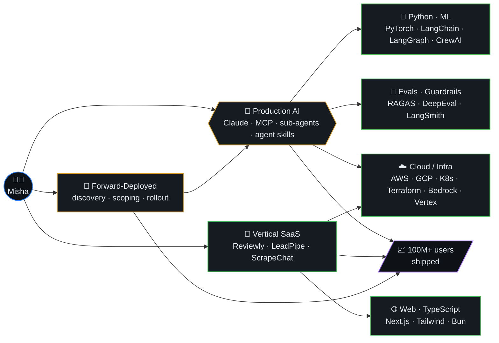
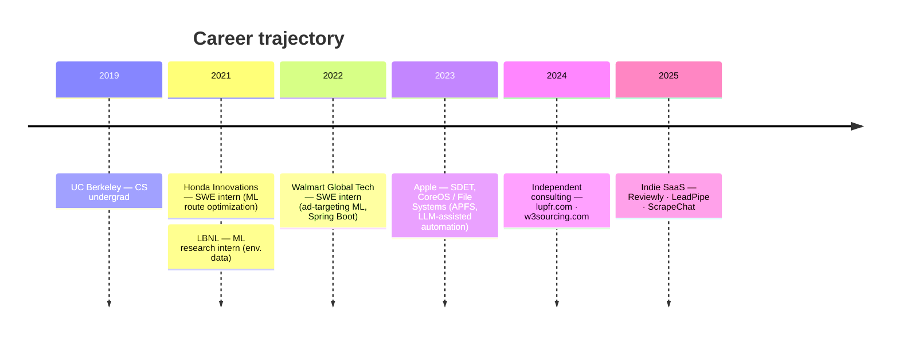
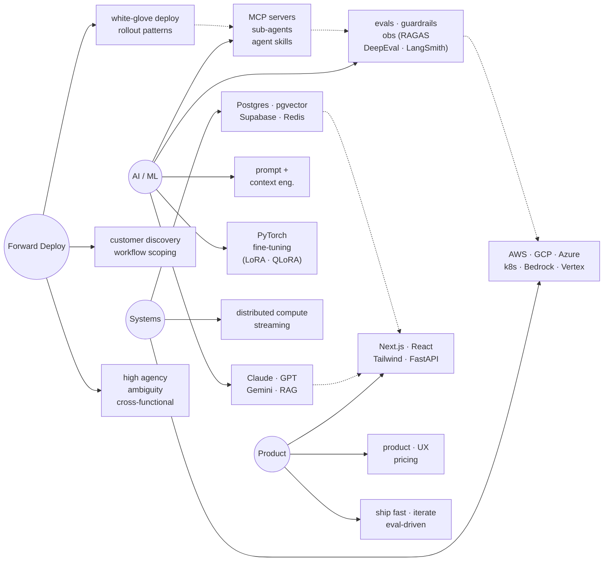

  

<h1 align="center">Hi, I'm Misha Lubich 👋</h1>

  

  
  
  

  <a href="https://mishalubich.com"><strong>mishalubich.com</strong></a> ·
  <a href="https://www.linkedin.com/in/misha-lubich/"><strong>LinkedIn</strong></a> ·
  <a href="https://scholar.google.com/citations?hl=en&user=Be6ZA78AAAAJ"><strong>Google Scholar</strong></a> ·
  <a href="mailto:Michaelle.lubich@gmail.com"><strong>Email</strong></a>

---

### 📚 Table of Contents

- [About Me](#-about-me)
- [What I'm Building](#-what-im-building)- [Career timeline](#-career-timeline)
- [Skill graph](#-skill-graph)- [Tech Stack](#️-tech-stack)
- [Featured Projects](#-featured-projects)
- [GitHub Stats](#-github-stats)
- [Profile Summary](#-profile-summary)
- [Trophies](#-trophies)
- [Contribution Graph](#-contribution-graph)
- [3D Contribution Calendar](#-3d-contribution-calendar)
- [Contribution Snake](#-contribution-snake)
- [Top Repos](#-top-repos)

---

### 🐍 Contribution Snake

  

---

### 👨‍💻 About Me

Forward-deployed AI engineer specializing in **customer-embedded production LLM delivery**. I sit with enterprise teams, scope real workflows, and ship Claude- and multi-model-powered applications hardened with evals, guardrails, and observability. Designed and deployed a production AI platform with multi-agent orchestration, MCP tool servers, sub-agents and RAG pipelines serving millions at sub-second P95. UC Berkeley CS grad with 6 published research papers and 100M+ users impacted.

- 🔭 **Currently:** Shipping production agentic systems — MCP servers, sub-agents, agent skills, eval harnesses
- 🤝 **How I work:** Embedded with customer engineering and domain teams; high agency under ambiguity; codify reusable deployment patterns
- 🧠 **Stack:** Claude (Sonnet/Opus/Haiku) · Anthropic API · OpenAI · Gemini · Python · TypeScript · FastAPI · Next.js · AWS / GCP / Azure
- 💬 **Ask me about:** Production LLM apps, agent design, prompt + context engineering, eval-driven iteration, customer discovery → rollout
- 📫 **Email:** [Michaelle.lubich@gmail.com](mailto:Michaelle.lubich@gmail.com)

---

### 🏗️ What I'm Building

---

### 🧭 Career timeline

---

### 🧠 Skill graph

---

### 🛠️ Tech Stack

   
   
   
   
   
  

**Languages:** Python · TypeScript · Go · Java · C++ · Rust · SQL  
**LLMs & APIs:** Claude (Sonnet · Opus · Haiku) · Anthropic API · OpenAI · Gemini · Llama · Qwen · DeepSeek · Bedrock · Vertex AI · Azure OpenAI  
**Agents & Tooling:** MCP tool servers · sub-agents · agent skills · multi-agent orchestration (CrewAI · LangGraph) · LangChain · LlamaIndex · function calling · structured output (Pydantic)  
**RAG & Vectors:** RAG pipelines · adaptive chunking · re-ranking · pgvector · FAISS · Pinecone · ChromaDB  
**Prompt & Context Engineering:** advanced prompt design · context engineering · guardrails · prompt-injection defense · OWASP LLM Top 10  
**Eval & Observability:** RAGAS · DeepEval · LangSmith · offline/online eval harnesses · A/B testing · Prometheus · Grafana · OpenTelemetry · Datadog  
**Fine-Tuning & Training:** PyTorch · TensorFlow · LoRA · QLoRA · vLLM · SageMaker · MLflow  
**Frontend:** React · Next.js · Tailwind CSS · Framer Motion · Streamlit · Gradio  
**Backend:** Node.js · FastAPI · Spring Boot · PostgreSQL · Supabase · Redis · Kafka · gRPC  
**Cloud:** AWS · GCP · Azure · Vercel · Docker · Kubernetes · Terraform · Pulumi  
**Customer Delivery:** technical discovery · workflow scoping · white-glove enterprise rollout · reusable deployment patterns · stakeholder communication · high-agency operation under ambiguity

---

### 🚀 Featured Projects

| Project | Description | Link |
|---------|-------------|------|
| **Lupfr** | SF music events & talent curation platform | [lupfr.com](https://lupfr.com) |
| **Reviewly** | AI-powered Google Review automation for businesses | [reviewly-self.vercel.app](https://reviewly-self.vercel.app) |
| **ScrapeChatAI** | Chat-based web scraper with AI-generated Playwright scripts | [scrapechat.vercel.app](https://scrapechat.vercel.app) |
| **LeadPipe AI** | AI-powered lead generation for local trade businesses | [leadpipe-two.vercel.app](https://leadpipe-two.vercel.app) |
| **W3Sourcing** | Premium recruitment website for Tech, Legal & Finance | [w3sourcing.com](https://w3sourcing.com) |
| **EnrichData** | AI-driven CRM enhancement platform | [enrichdata.net](https://enrichdata.net) |
| **Portfolio** | Personal portfolio with 2026 animations & glassmorphism | [mishalubich.com](https://mishalubich.com) |

---

### 📊 GitHub Stats

  
  

  

---

### 📈 Contribution Graph

  

---

###  Random Dev Quote

  

---

### 🪪 Profile Summary

  

  
  

  
  

---

### 📦 Pinned Projects

  
  

  
  

---

### 🧊 3D Contribution Calendar

  

---

### 📌 Top Repos

  
  
  
  

---

  

