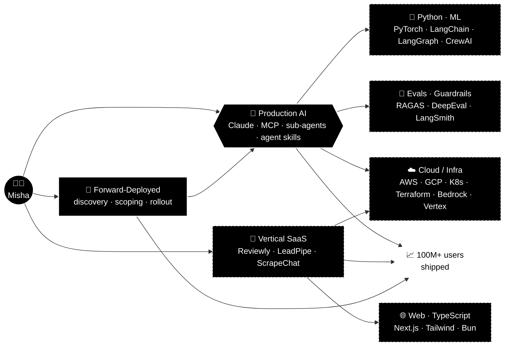
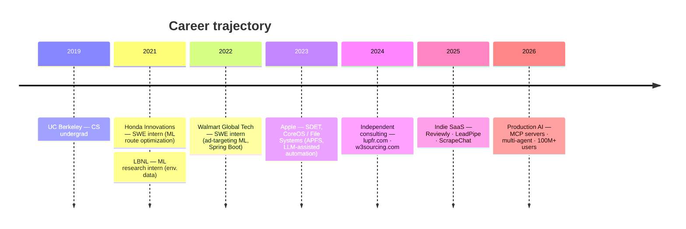
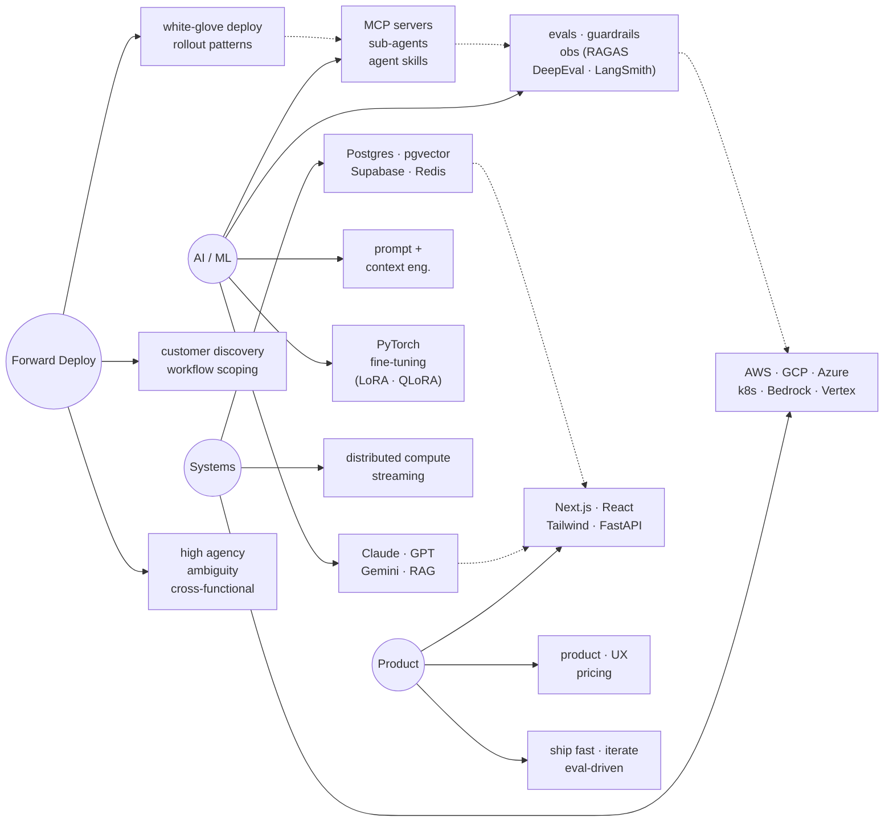

<!-- SEO: Misha Lubich | Forward-Deployed AI Engineer | Claude API | MCP servers | multi-agent orchestration | RAG pipelines | LLM production | UC Berkeley | ex-Apple | Python TypeScript Go | Anthropic | OpenAI | Gemini | LangChain | LangGraph | CrewAI | evals guardrails observability | FastAPI Next.js | AWS GCP Azure | 100M users | production machine learning | agent skills | sub-agents | context engineering | prompt engineering | RAGAS DeepEval LangSmith | pgvector FAISS Pinecone | LoRA QLoRA fine-tuning | forward deployed engineer | enterprise AI rollout | mishalubich.com -->

  

<h1 align="center">Hi, I'm Misha Lubich</h1>

<h3 align="center">Forward-Deployed AI Engineer &nbsp;·&nbsp; ex-Apple CoreOS &nbsp;·&nbsp; UC Berkeley CS</h3>

<em>Shipping production Claude, MCP & multi-agent systems to 100M+ users</em>

  

  
  
  
  
  
  

  
  
  
  
  

---

### Impact at a Glance

  
  
  
  
  
  

---

### AI Token Usage

  

  
  

---

### Table of Contents

- [About Me](#about-me)
- [AI Token Usage](#ai-token-usage)
- [What I'm Building](#what-im-building)
- [Career Timeline](#career-timeline)
- [Skill Graph](#skill-graph)
- [Tech Stack](#tech-stack)
- [Research & Publications](#research--publications)
- [Featured Projects](#featured-projects)
- [GitHub Stats](#github-stats)
- [Contribution Graph](#contribution-graph)
- [3D Contribution Calendar](#3d-contribution-calendar)
- [Contribution Snake](#contribution-snake)
- [Let's Collaborate](#lets-collaborate)

---

### Contribution Snake

  

---

### About Me

I'm **Misha Lubich**, a **Forward-Deployed AI Engineer** specializing in **customer-embedded, production-grade LLM (large language model) delivery**. I embed with enterprise engineering teams, scope real-world workflows, and ship **Anthropic Claude** and multi-model AI applications hardened with **evals, guardrails, and observability**. I designed and deployed a production AI platform with **multi-agent orchestration**, **Model Context Protocol (MCP) tool servers**, **sub-agents**, and **retrieval-augmented generation (RAG) pipelines** serving **100M+ users at sub-second P95 latency**. **UC Berkeley Computer Science** graduate, **ex-Apple (CoreOS / File Systems)**, with **6 published research papers**.

- **Currently:** Shipping production agentic AI systems — Model Context Protocol (MCP) servers, sub-agents, agent skills, and LLM eval harnesses
- **How I work:** Embedded with customer engineering and domain teams; high agency under ambiguity; codifying reusable enterprise AI deployment patterns
- **Stack:** Anthropic Claude (Sonnet · Opus · Haiku) · Claude API · OpenAI GPT · Google Gemini · Python · TypeScript · FastAPI · Next.js · AWS · GCP · Azure
- **Ask me about:** Production LLM applications, AI agent design, prompt engineering + context engineering, eval-driven development, multi-agent orchestration, MCP integrations
- **Reach me:** [michaelle.lubich@gmail.com](mailto:michaelle.lubich@gmail.com) · [mishalubich.com](https://mishalubich.com)
- **Keywords:** `AI engineer` · `LLM engineer` · `Claude API` · `Anthropic` · `MCP servers` · `multi-agent systems` · `RAG` · `forward-deployed engineer` · `production AI` · `LLM evals` · `AI guardrails`

---

### What I'm Building

---

### Career Timeline

---

### Skill Graph

---

### Tech Stack

   
   
   
   
   
  

**Languages:** Python · TypeScript · Go · Java · C++ · Rust · SQL  
**LLMs & APIs:** Claude (Sonnet · Opus · Haiku) · Anthropic API · OpenAI · Gemini · Llama · Qwen · DeepSeek · Bedrock · Vertex AI · Azure OpenAI  
**Agents & Tooling:** MCP tool servers · sub-agents · agent skills · multi-agent orchestration (CrewAI · LangGraph) · LangChain · LlamaIndex · function calling · structured output (Pydantic)  
**RAG & Vectors:** RAG pipelines · adaptive chunking · re-ranking · pgvector · FAISS · Pinecone · ChromaDB  
**Prompt & Context Engineering:** advanced prompt design · context engineering · guardrails · prompt-injection defense · OWASP LLM Top 10  
**Eval & Observability:** RAGAS · DeepEval · LangSmith · offline/online eval harnesses · A/B testing · Prometheus · Grafana · OpenTelemetry · Datadog  
**Fine-Tuning & Training:** PyTorch · TensorFlow · LoRA · QLoRA · vLLM · SageMaker · MLflow  
**Frontend:** React · Next.js · Tailwind CSS · Framer Motion · Streamlit · Gradio  
**Backend:** Node.js · FastAPI · Spring Boot · PostgreSQL · Supabase · Redis · Kafka · gRPC  
**Cloud:** AWS · GCP · Azure · Vercel · Docker · Kubernetes · Terraform · Pulumi  
**Customer Delivery:** technical discovery · workflow scoping · white-glove enterprise rollout · reusable deployment patterns · stakeholder communication · high-agency operation under ambiguity

---

### Research & Publications

  

6 peer-reviewed research papers spanning **machine learning**, **environmental data science**, and **systems**. Published during and after UC Berkeley — spanning work at Lawrence Berkeley National Laboratory (LBNL) and beyond.

> Full citation list → [scholar.google.com/citations?user=Be6ZA78AAAAJ](https://scholar.google.com/citations?hl=en&user=Be6ZA78AAAAJ)

---

### Featured Projects

| Project | Stack | Description | Link |
|---------|-------|-------------|------|
| **like-fable** | Prompt Engineering · LLM | Portable prompt library that makes any AI (Opus · GPT · Gemini · Cursor) operate like a top-tier collaborator | [github.com/ml-lubich/like-fable](https://github.com/ml-lubich/like-fable) |
| **twig** | Python · Rust · Typer | Git worktree CLI built for humans *and* agents — one-command create/jump/clean, JSON output on every command, real shell-hook `cd`, Rust hot path for agent swarms | [github.com/ml-lubich/twig](https://github.com/ml-lubich/twig) |
| **whatsapp-mcp** | Go · Python · MCP · Typer | Fork featuring `wa` — a gradient-styled CLI that daemonizes the WhatsApp bridge + MCP server and adds messaging/contacts/chats/doctor commands (TDD, 133 tests, 98% coverage); also fixed the upstream 405 client-outdated connect failure ([PR #294](https://github.com/lharries/whatsapp-mcp/pull/294)) | [github.com/ml-lubich/whatsapp-mcp](https://github.com/ml-lubich/whatsapp-mcp) |
| **Lupfr** | Next.js · TypeScript · AI | SF music events & talent curation platform | [lupfr.com](https://lupfr.com) |
| **Reviewly** | Claude API · Next.js · Supabase | AI-powered Google Review automation for businesses | [reviewly-self.vercel.app](https://reviewly-self.vercel.app) |
| **ScrapeChatAI** | Claude · Playwright · FastAPI | Chat-based web scraper with AI-generated browser scripts | [scrapechat.vercel.app](https://scrapechat.vercel.app) |
| **LeadPipe AI** | LLM · Next.js · Python | AI-powered lead generation for local trade businesses | [leadpipe-two.vercel.app](https://leadpipe-two.vercel.app) |
| **W3Sourcing** | Next.js · Tailwind | Premium recruitment platform — Tech, Legal & Finance | [w3sourcing.com](https://w3sourcing.com) |
| **EnrichData** | AI · CRM · APIs | AI-driven CRM data enhancement platform | [enrichdata.net](https://enrichdata.net) |
| **Portfolio** | Next.js · Framer Motion | Personal portfolio — 2026 animations & glassmorphism | [mishalubich.com](https://mishalubich.com) |
| **confluence-cli** | Node.js · Commander · Atlassian API | Confluence CLI with first-class bulk move/delete + idempotent mirror/migration — built to be safely driven by AI agents | [github.com/ml-lubich/confluence-cli](https://github.com/ml-lubich/confluence-cli) |
| **bitbucket-cli (`bb`)** | Python · Typer · httpx | gh-style CLI for Bitbucket Cloud & Data Center | [github.com/ml-lubich/bitbucket-cli](https://github.com/ml-lubich/bitbucket-cli) |

---

### GitHub Stats

  
  

  

  

---

### Contribution Graph

  

---

### 3D Contribution Calendar

  

---

### Dev Quote

  

---

### Let's Collaborate

Always interested in working with sharp people on hard problems. If any of these resonate, let's talk:

- **Production LLM / Agentic AI** — MCP servers, multi-agent systems, RAG, evals, guardrails
- **Forward-Deployed AI Engineering** — embedded enterprise AI delivery, workflow scoping → rollout
- **Technical Co-founding / Advising** — vertical SaaS, AI-native products
- **Research Collaboration** — ML, AI safety, applied NLP

**Reach out:** [michaelle.lubich@gmail.com](mailto:michaelle.lubich@gmail.com) · [mishalubich.com](https://mishalubich.com) · [LinkedIn](https://www.linkedin.com/in/misha-lubich/)

  

---

<!-- KEYWORDS (GitHub search indexing):
Misha Lubich · ml-lubich · Forward-Deployed AI Engineer · Claude API · Anthropic · MCP servers · model context protocol · multi-agent orchestration · sub-agents · agent skills · RAG pipelines · retrieval augmented generation · LLM production · large language models · prompt engineering · context engineering · evals · guardrails · LangChain · LangGraph · CrewAI · LlamaIndex · RAGAS · DeepEval · LangSmith · pgvector · FAISS · Pinecone · ChromaDB · LoRA · QLoRA · vLLM · fine-tuning · PyTorch · TensorFlow · Python · TypeScript · Go · FastAPI · Next.js · React · Tailwind · Supabase · PostgreSQL · Redis · Kafka · AWS · GCP · Azure · Vercel · Docker · Kubernetes · Terraform · UC Berkeley · ex-Apple · CoreOS · APFS · 100M users · production machine learning · enterprise AI · forward deployed engineer · AI platform · agentic systems · mishalubich.com
-->

  

