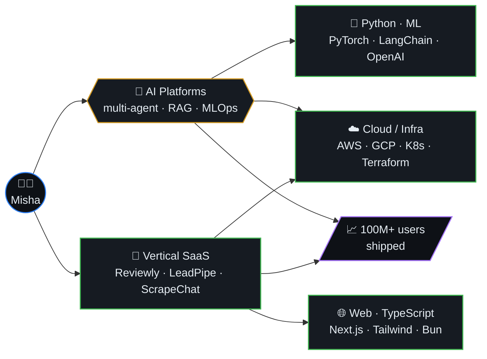

<h1 align="center">Hi, I'm Misha Lubich 👋</h1>

  

  
  
  

  <a href="https://mishalubich.com"><strong>mishalubich.com</strong></a> ·
  <a href="https://www.linkedin.com/in/misha-lubich/"><strong>LinkedIn</strong></a> ·
  <a href="https://scholar.google.com/citations?hl=en&user=Be6ZA78AAAAJ"><strong>Google Scholar</strong></a> ·
  <a href="mailto:Michaelle.lubich@gmail.com"><strong>Email</strong></a>

---

### 📚 Table of Contents

- [About Me](#-about-me)
- [What I'm Building](#-what-im-building)
- [Tech Stack](#️-tech-stack)
- [Featured Projects](#-featured-projects)
- [GitHub Stats](#-github-stats)
- [Contribution Graph](#-contribution-graph)
- [Contribution Snake](#-contribution-snake)

---

### 👨‍💻 About Me

Senior AI Engineer specializing in **AI-driven, cloud-native applications** that scale to millions of users. Led the design and deployment of production AI platforms with multi-agent orchestration at **Braintrust Data**, **Apple**, and **Walmart**. UC Berkeley CS grad with 6 published research papers and 100M+ users impacted.

- 🔭 **Currently:** Building AI-powered SaaS products & leading ML platform development at **Braintrust Data**
- 🌱 **Exploring:** Multi-agent systems, RAG pipelines, production ML at scale
- 💬 **Ask me about:** AI/ML systems, system design, clean code, shipping fast
- 📫 **Email:** [Michaelle.lubich@gmail.com](mailto:Michaelle.lubich@gmail.com)

---

### 🏗️ What I'm Building

---

### 🛠️ Tech Stack

   
   
  

**Languages:** Python · TypeScript · Go · Java · C++ · Rust · SQL  
**AI/ML:** PyTorch · TensorFlow · LangChain · OpenAI · RAG · Fine-Tuning · Multi-Agent Systems  
**Frontend:** React · Next.js · Tailwind CSS · Framer Motion  
**Backend:** Node.js · FastAPI · PostgreSQL · Supabase · Redis  
**Cloud:** AWS · GCP · Azure · Vercel · Docker · Kubernetes · Terraform  
**Tools:** Git · CI/CD · MLOps · Prompt Engineering

---

### 🚀 Featured Projects

| Project | Description | Link |
|---------|-------------|------|
| **Lupfr** | SF music events & talent curation platform | [lupfr.com](https://lupfr.com) |
| **Reviewly** | AI-powered Google Review automation for businesses | [reviewly-self.vercel.app](https://reviewly-self.vercel.app) |
| **ScrapeChatAI** | Chat-based web scraper with AI-generated Playwright scripts | [scrapechat.vercel.app](https://scrapechat.vercel.app) |
| **LeadPipe AI** | AI-powered lead generation for local trade businesses | [leadpipe-two.vercel.app](https://leadpipe-two.vercel.app) |
| **W3Sourcing** | Premium recruitment website for Tech, Legal & Finance | [w3sourcing.com](https://w3sourcing.com) |
| **EnrichData** | AI-driven CRM enhancement platform | [enrichdata.net](https://enrichdata.net) |
| **Portfolio** | Personal portfolio with 2026 animations & glassmorphism | [mishalubich.com](https://mishalubich.com) |

---

### 📊 GitHub Stats

  
  

  

---

### 📈 Contribution Graph

  

---

### 🐍 Contribution Snake

  

---

### 💡 Random Dev Quote

  

---

<i>Ship fast. Ship clean. Then ship faster.</i>

